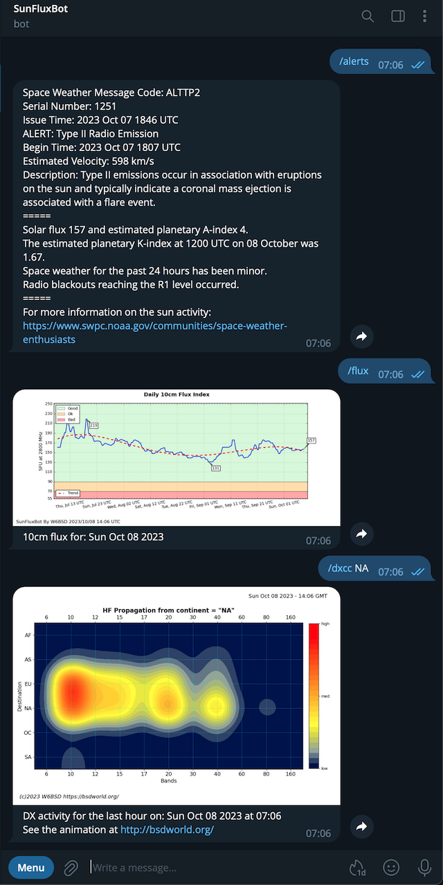

# SunFlux
Telegram Space Weather bot

This Telegram bot gives ham radio operators information about solar weather, propagation, and amateur radio activity on HF bands.

You can subscribe to this bot through the [Telegram](https://telegram.org) app on your phone, tablet, or computer.
The bot name is [@SunFluxBot](http://t.me/SunFluxBot).

## Telegram Bot commands

The Telegram Bot has the following commands:
  - aindex - A Index
  - alerts - NOAA Alerts
  - dxcc - Show dxcc contacts
  - flux - 10cm Flux
  - geost - GeoSpace Timeline
  - kpindex - K Index
  - swx - Solar indices overvew
  - tec - Total Electron Content
  - warning - Warning timelines

For more information check [0x9900's blog](https://0x9900.com/telegram-propagation-bot/) post
